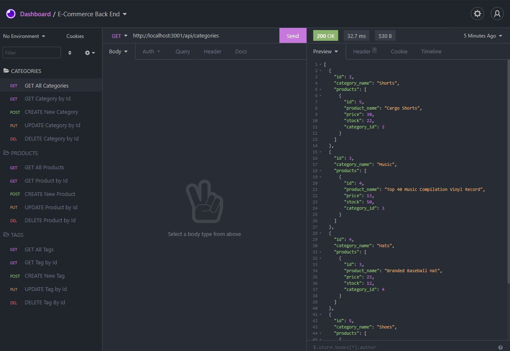

# Employee Tracker


[](https://watch.screencastify.com/v/wBF46MOQeXYhJPuMURU8)

_CLICK ON THE IMAGE TO SEE A DEMO_

## Getting Started

These instructions will get you a copy of the project up and running on your local machine for development and testing purposes.

### Prerequisites

Please have these installed before continuing:

* [Git](https://git-scm.com/downloads)
* [Node.js](https://nodejs.org/en/download/)
* [MySQL](https://dev.mysql.com/downloads/windows/installer/8.0.html)
* [Visual Studio Code](https://code.visualstudio.com/Download)

You will also need a github account. Get one [here](https://github.com/).

### Installing

1. Fork the project to your account.

    

2. Click the green code button and copy the SSH url. Should look like this:
    ```
    git@github.com:<username>/e-commerce-back-end.git
    ```
3. Open Git bash terminal and navigate to your desktop.
    ```
    cd Desktop/
    ```
4. Clone the repository to your desktop. You can right click on the terminal to paste the SSH url.
    ```
    git clone git@github.com:<username>/e-commerce-back-end.git
    ```
5. Navigate to the repository and into develop folder.
    ```
    cd e-commerce-back-end/
    ```
6. Download and install required dependencies.
    ```
    npm install
    ```
7. Create your <code>.env</code> file.
    ```
    touch .env
    ```
8. Open your <code>.env</code> file using VS Code.
    ```
    code .env
    ```
9. Add this to the file, where <code>DB_USER</code> and <code>DB_PW</code> are your MySQL credentials, and save it.
    ```
    DB_NAME='ecommerce_db'
    DB_USER=''
    DB_PW=''
    ```
10. Back on terminal navigate to <code>/db/</code> and start MySQL command line and log in.
    ```
    cd db/
    mysql -u <username> -p
    ```
11. Create the database.
    ```
    source schema.sql
    ```
12. Quit the MySQL command line.
    ```
    quit
    ```
13. Go back to the root directory and seed the database.
    ```
    cd ..
    npm run seed
    ```
14. All Done!
### Usage

1. Now that everything is set up, to start the server:

        npm start


## Built With

* [Node.js](https://nodejs.org/docs/latest-v15.x/api/)
* [Express](https://expressjs.com/en/4x/api.html)
* [mysql2](https://www.npmjs.com/package/mysql2)
* [Sequelize](https://sequelize.org/master/index.html)
* [dotenv](https://www.npmjs.com/package/dotenv)
* [MySQL](https://dev.mysql.com/doc/refman/8.0/en/)


## Authors

* **Isaac Cortes Hernandez** 

- [Link to Portfolio Site](https://icortes.github.io/my-first-portfolio/)
- [Link to Github](https://github.com/icortes)
- [Link to LinkedIn](https://www.linkedin.com/in/cortes-isaac)

## License

This project is licensed under the MIT License 

## Acknowledgments

* Node.js documentation
* inquirer documentation
